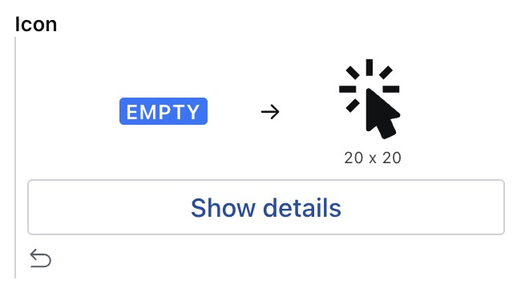
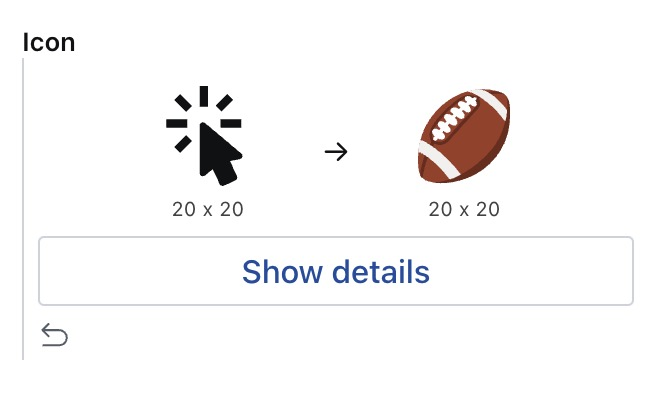
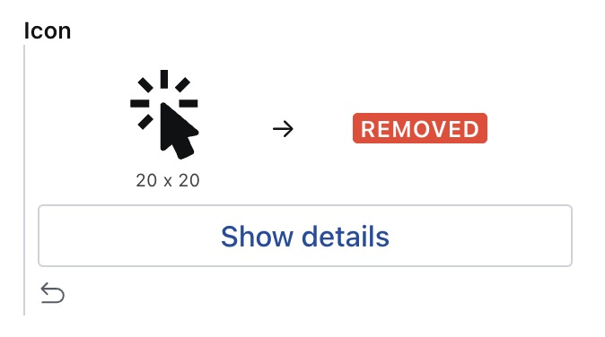
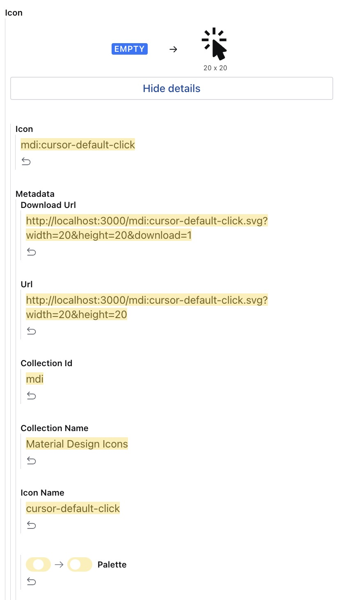

# Iconify Plugin

- [⚡️ Features](#%EF%B8%8F-features)
- [🔌 Installation](#-installation)
- [🧑‍💻 Usage](#-usage)
- [⚙️ Plugin Configuration](#%EF%B8%8F-plugin-configuration)
- [🎭 Custom Diff View](-custom-diff-view)
- [🗃️ Data Model](#%EF%B8%8F-data-model)
- [📝 License](#-license)
- [🧪 Develop & test](#-develop--test)

## ⚡️ Features

- Sanity v3 plugin
- Icons are customizable
- Store the svg code in Sanity
- Media preview component for your entry
- Download or copy to clipboard your icon
- Custom Diff View
- Custom Preview Component
- Provide your own color palette for monochrome icons
- Basic API Hosting

## 🔌 Installation

```sh
npm install sanity-plugin-iconify
```

## 🧑‍💻 Usage

Add it as a plugin in `sanity.config.ts` (or .js):

```ts
import {defineConfig} from 'sanity'
import {IconifyPlugin} from 'sanity-plugin-iconify'

export default defineConfig({
  //...
  plugins: [
    IconifyPlugin({
      // your optional configuration here
    }),
  ],
  // ...
})
```

The plugin will provide one new object type called: `iconify`. You can define a new field with this type inside your documents.

```ts
import {defineField, defineType} from 'sanity'

const SampleDocument = defineType({
  type: 'document',
  name: 'sampleDocument',
  title: 'Sample Document',
  fields: [
    // ...
    defineField({
      type: 'iconify',
      name: 'icon',
      title: 'Icon',
    }),
    // ...
  ],
})

export default IconifyDocument
```

## ⚙️ Plugin Configuration

This is the main configuration of the plugin, and the available options are as follows:

```ts
{
  // This is the endpoint if you decide to host your icon sets on your own server. For more details, see the dedicated session below
  customEndpoint?: string

  // an optional array of custom color palette
  customPalette?: [
    {
      hex: string, // the hex of your custom color
      title?: string // an optional title for you custom color used as tooltip inside the color picker.
    },
    // other colors
  ]
}
```

## 🎭 Custom Diff View

The plugin comes with a [custom diff component](https://www.sanity.io/docs/custom-diff-components) that lets you see the differences in a more human-readable way.
You can have tree different custom diff views:

### Icon Added

<p align="left">
  
</p>

### Icon Changed

<p align="left">
  
</p>

### Icon Removed

<p align="left">
  
</p>

In any of the above cases you can always see the list of all the changes clicking on the `Show details` CTA.

<p align="left">
  
</p>

## 🗃️ Data model

```ts
  {
    _type: 'iconify',
    icon: string
    metadata: {
      iconName: string
      collectionId: string
      collectionName: string
      url: string
      downloadUrl: string
      inlineSvg: string
      hFlip: boolean
      vFlip: boolean
      rotate: number
      size: {
        width: number
        height: number
      }
      color: {
        hex: string
        rgba: {
          r: number
          g: number
          b: number
          a: number
        }
      }
      palette: boolean
      author: {
        name: string
        url: string
      },
      license: {
        name: string
        url: string
      }
    }
  }
```

## 📝 License

[MIT](LICENSE) © William Iommi

## 🧪 Develop & test

This plugin uses [@sanity/plugin-kit](https://github.com/sanity-io/plugin-kit)
with default configuration for build & watch scripts.

See [Testing a plugin in Sanity Studio](https://github.com/sanity-io/plugin-kit#testing-a-plugin-in-sanity-studio)
on how to run this plugin with hotreload in the studio.

### Release new version

Run ["CI & Release" workflow](https://github.com/williamiommi/sanity-plugin-i18n-fields/actions/workflows/main.yml).
Make sure to select the main branch and check "Release new version".

Semantic release will only release on configured branches, so it is safe to run release on any branch.

# una nota sulla sessione, magari da rendere opzionale?

# rendere opzionale anche lo store inline dell'icona? se metti a true sarà sempre settato a true, ma puoi decheccarlo se vuoi sulla singola icona. Oppure anche come opzione sul field (piu complicato quest'ultimo).
