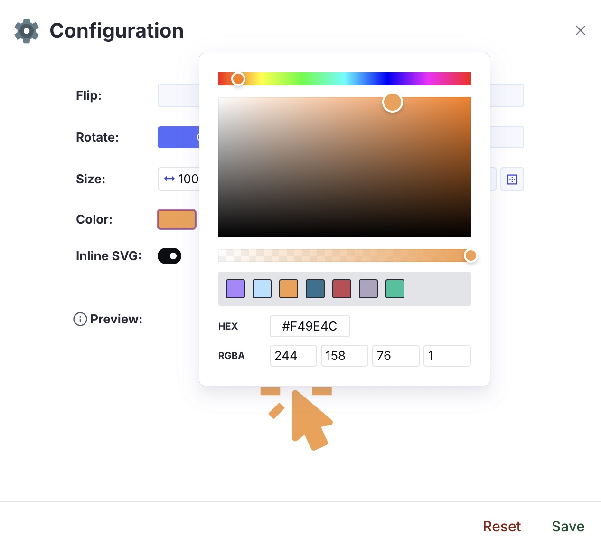

# Iconify Plugin

A Sanity plugin to select, manage and customize icons based on and powered by the amazing [iconify project](https://iconify.design/)

- [⚡️ Features](#%EF%B8%8F-features)
- [🔌 Installation](#-installation)
- [🧑‍💻 Usage](#-usage)
- [⚙️ Plugin Configuration](#%EF%B8%8F-plugin-configuration)
- [👀 Document List Preview](#-document-list-preview)
- [🧩 Add Icons to Portable Text](#-add-icons-to-portable-text)
- [🎨 Custom Color Palette](#-custom-color-palette)
- [🎭 Custom Diff View](#-custom-diff-view)
- [🗃️ Data Model](#%EF%B8%8F-data-model)
- [🎬 How to render the icon on your website](#-how-to-render-the-icon-on-your-website)
- [📝 License](#-license)
- [🧪 Develop & test](#-develop--test)

## ⚡️ Features

- Sanity v3 plugin
- Icons are customizable
- Store the svg code in Sanity
- Media preview component for your entry
- Download or copy to clipboard your icon
- Presence and Change Indicator preserved
- Custom Diff View
- Provide your own color palette for monochrome icons
- Basic API Hosting

## 🔌 Installation

```sh
npm install sanity-plugin-iconify
```

## 🧑‍💻 Usage

Add it as a plugin in `sanity.config.ts` (or .js):

```ts
import {defineConfig} from 'sanity'
import {IconifyPlugin} from 'sanity-plugin-iconify'

export default defineConfig({
  //...
  plugins: [
    IconifyPlugin({
      // your optional configuration here
    }),
  ],
  // ...
})
```

The plugin will provide one new object type called: `iconify`. You can define a new field with this type inside your documents.

```ts
import {defineField, defineType} from 'sanity'

const SampleDocument = defineType({
  type: 'document',
  name: 'sampleDocument',
  title: 'Sample Document',
  fields: [
    // ...
    defineField({
      type: 'iconify',
      name: 'icon',
      title: 'Icon',
    }),
    // ...
  ],
})

export default SampleDocument
```

## ⚙️ Plugin Configuration

This is the main configuration of the plugin, and the available options are as follows:

```ts
{
  // This is the endpoint if you decide to host your icon sets on your own server. For more details, see the dedicated session below
  customEndpoint?: string

  // an optional array of custom color palette
  customPalette?: [
    {
      hex: string, // the hex of your custom color
      title?: string // an optional title for you custom color used as tooltip inside the color picker.
    },
    // other colors
  ]
}
```

## 👀 Document List Preview

The plugin provides a component that you can use as a [media preview](https://www.sanity.io/docs/previews-list-views) of your icon within your document list.
You can pass a second argument (a `true` boolean value) to the function if you want to see always the original icon.

```ts
import {defineField, defineType} from 'sanity'
import {mediaPreview} from 'sanity-plugin-iconify'

const SampleDocument = defineType({
  type: 'document',
  name: 'sampleDocument',
  title: 'Sample Document',
  preview: {
    select: {
      // ...
      icon: 'icon'
    },
    prepare({icon, ...rest}) {
      return {
        // ...rest
        media: mediaPreview(icon)
      }
    }
  }
  fields: [
    // ...
    defineField({
      type: 'iconify',
      name: 'icon',
      title: 'Icon',
    }),
    // ...
  ],
})

export default SampleDocument
```

<p align="center">
  
</p>

## 🧩 Add Icons to Portable Text

You can easily use the plugin inside your Portable Text both for inline or block components. The preview will shows the rendered icon and the related name.

```ts
import {defineField, defineType} from 'sanity'

const SampleDocument = defineType({
  type: 'document',
  name: 'sampleDocument',
  title: 'Sample Document',
  fields: [
    // ...
    defineField({
      name: 'body',
      type: 'array',
      title: 'Body',
      of: [
        {
          type: 'block',
          of: [{type: IconifyMetadata.name, title: 'Iconify Inline'}],
        },
        {
          type: IconifyMetadata.name,
          title: 'Iconify Block',
        },
      ],
    }),
    // ...
  ],
})

export default SampleDocument
```

<p align="center">
  
</p>

## 🎨 Custom Color Palette

You can pass a list of custom colors to fill your monochrome icons with your brand identity.
You need to provide a list of valid hex colors (with an optional title).
As a result, you will have access to these colors within the color picker, available when you customize a monochrome icon.

```ts
import {defineConfig} from 'sanity'
import {IconifyPlugin} from 'sanity-plugin-iconify'

export default defineConfig({
  //...
  plugins: [
    IconifyPlugin({
      customPalette: [
        {
          hex: '#AB87FF',
          title: 'Tropical Indigo',
        },
        {
          hex: '#B4E1FF',
          title: 'Uranian Blue',
        },
        {
          hex: '#F49E4C',
          title: 'Sandy brown',
        },
        {
          hex: '#2D728F',
          title: 'Cerulean',
        },
        {
          hex: '#C14953',
          title: 'Bittersweet shimmer',
        },
        {
          hex: '#AEA4BF',
          title: 'Rose quartz',
        },
        {
          hex: '#02C39A',
          title: 'Mint',
        },
      ],
    }),
  ],
  // ...
})
```

<p align="left">
  
</p>

## 🎭 Custom Diff View

The plugin comes with a [custom diff component](https://www.sanity.io/docs/custom-diff-components) that lets you see the differences in a more human-readable way.
You can have tree different custom diff views:

### Icon Added

<p align="left">
  
</p>

### Icon Changed

<p align="left">
  
</p>

### Icon Removed

<p align="left">
  
</p>

In any of the above cases you can always see the list of all the changes clicking on the `Show details` CTA.

<p align="left">
  
</p>

## 🗃️ Data model

```ts
  {
    _type: 'iconify',
    icon: string
    metadata: {
      iconName: string
      collectionId: string
      collectionName: string
      url: string
      downloadUrl: string
      inlineSvg: string
      hFlip: boolean
      vFlip: boolean
      rotate: number
      size: {
        width: number
        height: number
      }
      color: {
        hex: string
        rgba: {
          r: number
          g: number
          b: number
          a: number
        }
      }
      palette: boolean
      author: {
        name: string
        url: string
      },
      license: {
        name: string
        url: string
      }
    }
  }
```

## 📝 License

[MIT](LICENSE) © William Iommi

## 🧪 Develop & test

This plugin uses [@sanity/plugin-kit](https://github.com/sanity-io/plugin-kit)
with default configuration for build & watch scripts.

See [Testing a plugin in Sanity Studio](https://github.com/sanity-io/plugin-kit#testing-a-plugin-in-sanity-studio)
on how to run this plugin with hotreload in the studio.

### Release new version

Run ["CI & Release" workflow](https://github.com/williamiommi/sanity-plugin-i18n-fields/actions/workflows/main.yml).
Make sure to select the main branch and check "Release new version".

Semantic release will only release on configured branches, so it is safe to run release on any branch.

# una nota sulla sessione, magari da rendere opzionale?

# rendere opzionale anche lo store inline dell'icona? se metti a true sarà sempre settato a true, ma puoi decheccarlo se vuoi sulla singola icona. Oppure anche come opzione sul field (piu complicato quest'ultimo).

```

```
