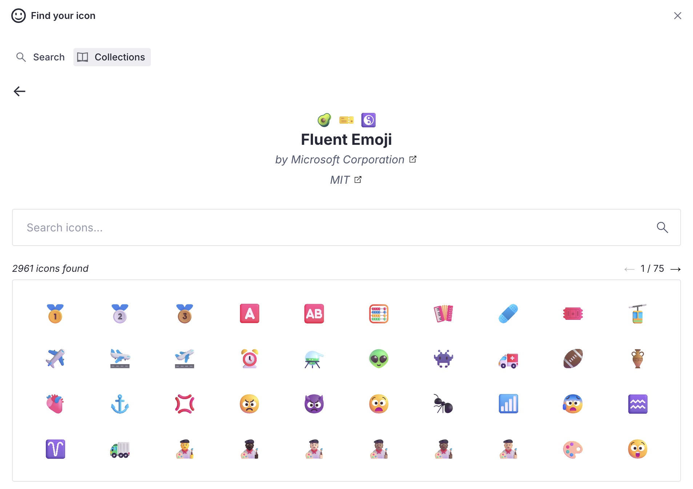

# Sanity Icon Manager

<p align="center">
  
</p>
<p align="center">
  
</p>

A Sanity plugin for selecting, managing, and customizing icons. Inspired by [sanity-plugin-icon-picker](https://github.com/christopherafbjur/sanity-plugin-icon-picker).\
Powered by [Iconify](https://iconify.design/)

- [🚨 Requirements](#-requirements)
- [⚡️ Features](#%EF%B8%8F-features)
- [🔌 Installation](#-installation)
- [🧑‍💻 Usage](#-usage)
- [⚙️ Plugin Configuration](#%EF%B8%8F-plugin-configuration)
- [··· Context menu](#-context-menu)
- [👀 Document List Preview](#-document-list-preview)
- [🧩 Add Icons to Portable Text](#-add-icons-to-portable-text)
- [🎨 Custom Color Palette](#-custom-color-palette)
- [🎭 Custom Diff View](#-custom-diff-view)
- [🗂️ Collections Tab](#%EF%B8%8F-collections-tab)
- [{} JSON Dialog](#-json-dialog)
- [🌎 Basic Hosting](#-basic-hosting)
- [🗃️ Data Model](#%EF%B8%8F-data-model)
- [🎬 How to render the icon on your website](#-how-to-render-the-icon-on-your-website)
- [🛣️ Roadmap](#%EF%B8%8F-roadmap)
- [📝 License](#-license)
- [🧪 Develop & test](#-develop--test)
  <br /><br />

## 🚨 Requirements

> [!WARNING]  
> Starting from version 2, with the introduction of studio localization, the plugin requires Sanity Studio version 3.23.0 or later. For more information, see the following [link](https://www.sanity.io/docs/internationalizing-plugins-ui).

<br /><br />

## ⚡️ Features

- Sanity v3 plugin
- Customizable icons
- SVG code stored in Sanity
- Media preview component for your entry
- Download or copy to clipboard your icon
- Presence and Change Indicator preserved
- Custom Diff View
- Provide your own color palette for monochrome icons
- Basic API Hosting
- v1.1.0+: Search filter 'Collection'
- v1.2.0+: Collections tab
- v1.3.0+: Global 'inline-svg' option
- v1.4.0+: Limit Collections option
- v1.5.0+: Global 'default size' option
- v2+:
  - Localization capabilities
  - UI refresh for some components
  - New JSON Dialog

<br /><br />

## 🔌 Installation

```sh
npm install sanity-plugin-icon-manager
```

<br /><br />

## 🧑‍💻 Usage

Add it as a plugin in `sanity.config.ts` (or .js):

```ts
import {defineConfig} from 'sanity'
import {IconManager} from 'sanity-plugin-icon-manager'

export default defineConfig({
  //...
  plugins: [
    IconManager({
      // your optional configuration here
    }),
  ],
  // ...
})
```

The plugin introduces one new object type called: `icon.manager`. You can define a new field with this type inside your documents.

```ts
import {defineField, defineType} from 'sanity'

const SampleDocument = defineType({
  type: 'document',
  name: 'sampleDocument',
  title: 'Sample Document',
  fields: [
    // ...
    defineField({
      type: 'icon.manager',
      name: 'icon',
      title: 'Icon',
    }),
    // ...
  ],
})

export default SampleDocument
```

<br /><br />

## ⚙️ Plugin Configuration

This is the main configuration of the plugin. The available options are:

```ts
{

  // This global option allows you to set a default width and height for newly saved icons. If not set, the size defaults to 20x20, as it was before v1.5.0.
  defaultSize?: { width: number, height: number }

  // An array of strings containing a subset of collection IDs (e.g., ['ant-design', 'material-']). This can be used when you want to limit access to only specific collections. It utilizes the 'prefixes' query parameter available on the Iconify API. More information can be found here (https://iconify.design/docs/api/collections.html).
  availableCollections?: string[]

  // When set to true, this global option allows you to automatically store the inline version of the selected icon. This means that the 'Inline Svg' checkbox will be preselected by default when you choose a new icon.
  inlineSvg?: boolean

  // This is the endpoint if you decide to host your icon sets on your own server. For more details, see the dedicated session below
  customEndpoint?: string

  // an optional array of custom color palette
  customPalette?: [
    {
      hex: string, // the hex code of your custom color
      title?: string // an optional title for you custom color used as a tooltip inside the color picker.
    },
    // other colors
  ]
}
```

<br /><br />

## ··· Context menu

Starting from version 2, you have access to a context menu (clicking on the ···) where you can see some information about the selected icon. You have a few options to download or copy the icon to the clipboard.

<p align="center">
  
</p>

<br /><br />

## 👀 Document List Preview

The plugin provides a component that you can use as a [media preview](https://www.sanity.io/docs/previews-list-views) of your icon within your document list.\
You can pass a second argument (a `true` boolean value) to the function if you want to see always the original icon.

```ts
import {defineField, defineType} from 'sanity'
import {mediaPreview} from 'sanity-plugin-icon-manager'

const SampleDocument = defineType({
  type: 'document',
  name: 'sampleDocument',
  title: 'Sample Document',
  preview: {
    select: {
      // ...
      icon: 'icon'
    },
    prepare({icon, ...rest}) {
      return {
        // ...rest
        media: mediaPreview(icon)
      }
    }
  }
  fields: [
    // ...
    defineField({
      type: 'icon.manager',
      name: 'icon',
      title: 'Icon',
    }),
    // ...
  ],
})

export default SampleDocument
```

<p align="center">
  
</p>

<br /><br />

## 🧩 Add Icons to Portable Text

You can easily use the plugin inside your Portable Text, both for inline or block components. The preview will shows the rendered icon and its related name.

```ts
import {defineField, defineType} from 'sanity'

const SampleDocument = defineType({
  type: 'document',
  name: 'sampleDocument',
  title: 'Sample Document',
  fields: [
    // ...
    defineField({
      name: 'body',
      type: 'array',
      title: 'Body',
      of: [
        {
          type: 'block',
          of: [{type: 'icon.manager', title: 'Inline Icon'}],
        },
        {
          type: 'icon.manager',
          title: 'Block Icon',
        },
      ],
    }),
    // ...
  ],
})

export default SampleDocument
```

<p align="center">
  
</p>

<br /><br />

## 🎨 Custom Color Palette

You can pass a list of custom colors to fill your monochrome icons with your brand identity.
You need to provide a list of valid hex colors (with an optional title).\
As a result, you will have access to these colors within the color picker when customizing a monochrome icon.

```ts
import {defineConfig} from 'sanity'
import {IconManager} from 'sanity-plugin-icon-manager'

export default defineConfig({
  //...
  plugins: [
    IconManager({
      customPalette: [
        {
          hex: '#AB87FF',
          title: 'Tropical Indigo',
        },
        {
          hex: '#B4E1FF',
          title: 'Uranian Blue',
        },
        {
          hex: '#F49E4C',
          title: 'Sandy brown',
        },
        {
          hex: '#2D728F',
          title: 'Cerulean',
        },
        {
          hex: '#C14953',
          title: 'Bittersweet shimmer',
        },
        {
          hex: '#AEA4BF',
          title: 'Rose quartz',
        },
        {
          hex: '#02C39A',
          title: 'Mint',
        },
      ],
    }),
  ],
  // ...
})
```

<p align="left">
  
</p>

<br /><br />

## 🎭 Custom Diff View

The plugin includes a [custom diff component](https://www.sanity.io/docs/custom-diff-components) that allows you to view differences in a more human-readable way.
You can have three different custom diff views:

### Icon Added

<p align="left">
  
</p>

### Icon Changed

<p align="left">
  
</p>

### Icon Removed

<p align="left">
  
</p>

In any of the above cases you can always see the list of all the changes clicking on the `Show details` CTA.

<p align="left">
  
</p>

<br /><br />

## 🗂️ Collections Tab

Starting from v.1.2.0, you can browse icons through all available collections.\
The search dialog now offers a 'Tabs view' where you can choose to search for your icons as before or via the new 'Collections' tab. Here, you can scroll through all the available collections, select one, and choose an icon from the available options within the selected collection.

<p align="center">
  
</p>

<p align="center">
  
</p>

<br /><br />

## {} JSON Dialog

Starting from version 2, you can view the data stored in Sanity through a dedicated dialog. It is possible to copy the JSON to the clipboard.

<p align="center">
  
</p>

<br /><br />

## 🌎 Basic Hosting

The Iconify project allows you to host the API on your server. You can learn more about it in their [official documentation](https://iconify.design/docs/api/hosting.html).\
This plugin offers a basic customization through the `customEndpoint` option. If you pass a valid URL, hosting a custom Iconify implementation, the plugin will use it as the base path for all the interactions (searching and rendering).

```ts
import {defineConfig} from 'sanity'
import {IconManager} from 'sanity-plugin-icon-manager'

export default defineConfig({
  //...
  plugins: [
    IconManager({
      customEndpoint: 'https://my.iconify.project.com',
    }),
  ],
  // ...
})
```

<br /><br />

## 🗃️ Data model

```ts
  {
    _type: 'icon.manager',
    icon: string
    metadata: {
      iconName: string
      collectionId: string
      collectionName: string
      url: string
      downloadUrl: string
      inlineSvg: string
      hFlip: boolean
      vFlip: boolean
      flip: 'horizontal' | 'vertical' | 'horizontal,vertical'
      rotate: 0 | 1 | 2 | 3
      size: {
        width: number
        height: number
      }
      color: {
        hex: string
        rgba: {
          r: number
          g: number
          b: number
          a: number
        }
      }
      palette: boolean
      author: {
        name: string
        url: string
      },
      license: {
        name: string
        url: string
      }
    }
  }
```

<br /><br />

## 🎬 How to render the icon on your website

Regardless of how you retrieve data from Sanity, you can render the icon in different ways.\
You can use the inline option to render the SVG directly. Alternatively, Iconify provides various rendering possibilities:

- [React](https://iconify.design/docs/icon-components/react/)
- [Vue](https://iconify.design/docs/icon-components/vue/)
- [Svelte](https://iconify.design/docs/icon-components/svelte/)
- [More...](https://iconify.design/docs/usage/)

Here an example with the React package:

```ts
// Let's assume that we have retrieved the following data from Sanity

{
  icon: 'bi:check2-circle',
  metadata: {
    flip: 'horizontal',
    size: {
      width: 20,
      height: 20,
    },
    rotate: 0,
    color: {
      hex: '#6aceeb'
    }
  }
}

------------------------------------------------------------------------------------

import {Icon} from '@iconify/react'

const MyComponent = (props) => {
  const {icon, metadata: {flip, rotate, size, color} } = props
  return (
    <Icon
      icon={icon}
      flip={flip}
      rotate={rotate}
      width={size.width}
      height={size.height}
      style={{color: color.hex}}
    />
  )
}
```

<br /><br />

## 🛣️ Roadmap

- ~~Filter by Collection~~ (v1.1.0+)
- ~~Search within an entire collection~~ (v1.2.0+)
- Analyze the possibility of adding [custom icon sets](https://iconify.design/docs/icons/custom.html) via configuration
- 🤔

<br /><br />

## 📝 License

[MIT](LICENSE) © William Iommi

## 🧪 Develop & test

This plugin uses [@sanity/plugin-kit](https://github.com/sanity-io/plugin-kit)
with default configuration for build & watch scripts.

See [Testing a plugin in Sanity Studio](https://github.com/sanity-io/plugin-kit#testing-a-plugin-in-sanity-studio)
on how to run this plugin with hotreload in the studio.

### Release new version

Run ["CI & Release" workflow](https://github.com/williamiommi/sanity-plugin-i18n-fields/actions/workflows/main.yml).
Make sure to select the main branch and check "Release new version".

Semantic release will only release on configured branches, so it is safe to run release on any branch.
